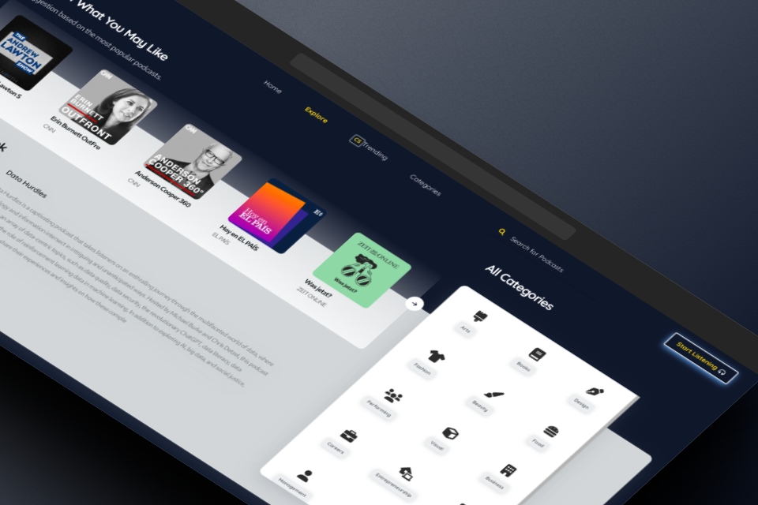
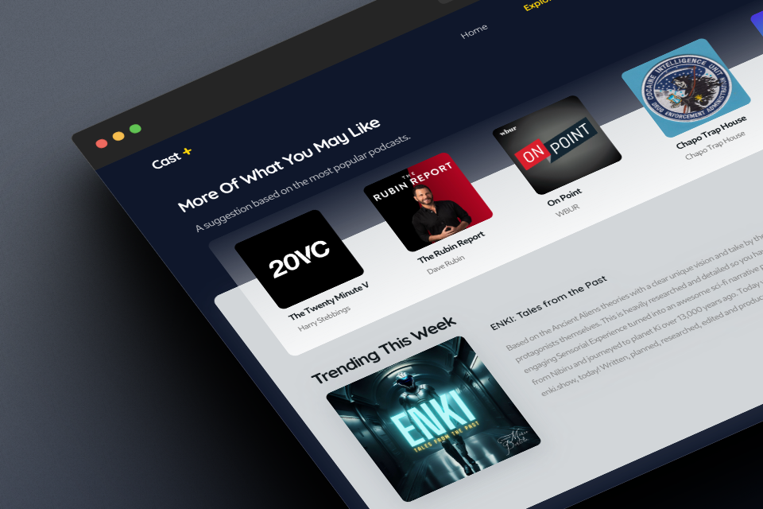

<div align="center">

# Cast Plus 

Discover new podcasts, subscribe, and listen to your favorite podcast episodes with CAST PLUS. 🎧

Check out the demo [here](https://castplus.netlify.app/).

 
</div>

## Description


By diving into the world of podcasts, you open up a vast array of captivating audio content. Whether you're into storytelling, educational discussions, true crime mysteries, comedy, or anything in between, podcasts offer something for everyone. Stay informed on current events, gain insights from experts in various fields, or simply unwind with delightful storytelling.

> ⚠️ Note: Please use a VPN to have better user experience :)


## Table of Contents

- [Installation](#installation)
- [Envs](#envs)
- [Lint](#lint)
- [Shots](#shots)
- [Contributing](#how-to-contribute)

## installation

To install the dependencies and start the app first set the envs according to the [envs section](#envs) then run:

```bash
npm install
npm run dev
```

### Envs

- `VITE_API_KEY`: A valid API key to access `podcastindex` api.
- `VITE_API_SECRET`: Podcastindex secret key.

> To get the above info you can visit [podcast index](https://podcastindex.org)
 
> Note that you should use the `VITE_` prefix in all env variables.


### Build

Builds the app for production to the `build` folder.\
It correctly bundles React in production mode and optimizes the build for the best
performance.


```bash
npm run build
```

### Lint

To run the linter to auto-fix all the problems run:

```bash
npm run lint
```

## How to Contribute

To improve this project even more, do contribute! Your contributions, whether they be to repair a problem, add a feature, or enhance the documentation, are much valued.

### Getting Started

1. Fork this repository and then clone it to your local machine.
2. Create a new branch for your feature or bug fix: `git checkout -b my-feature`.
3. Make your changes and commit them with descriptive commit messages: `git commit -m 'Add new feature'`.
4. Push your changes to your fork: `git push origin my-feature`.
5. Create a pull request (PR) against the `master` branch of this repository.

### Issues and Bug Reports 📝

If you find any bugs or issues with the project, please [create a new issue]([https://github.com/yourusername/yourproject/issues](https://github.com/erfan-goodarzi/cast-plus/issues/new)) on GitHub. Include as much detail as possible to help us understand and reproduce the problem.

## Shots
 

 

> Visit the full version [here](https://castplus.netlify.app/).
